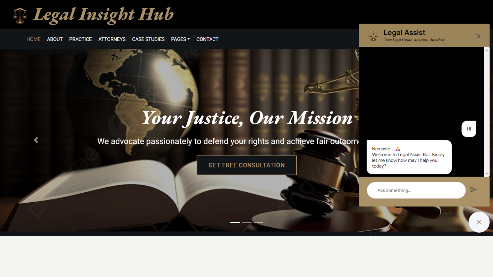
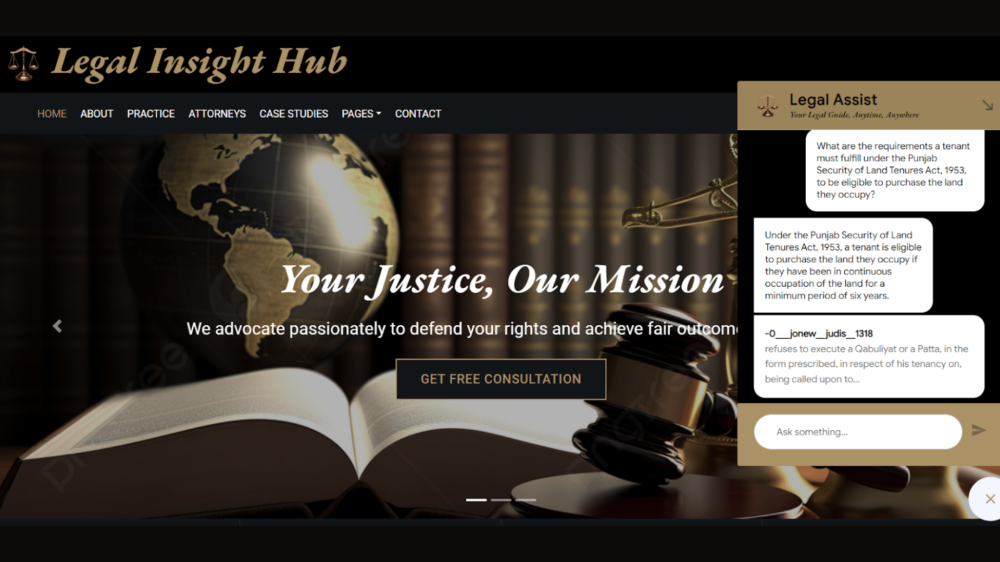
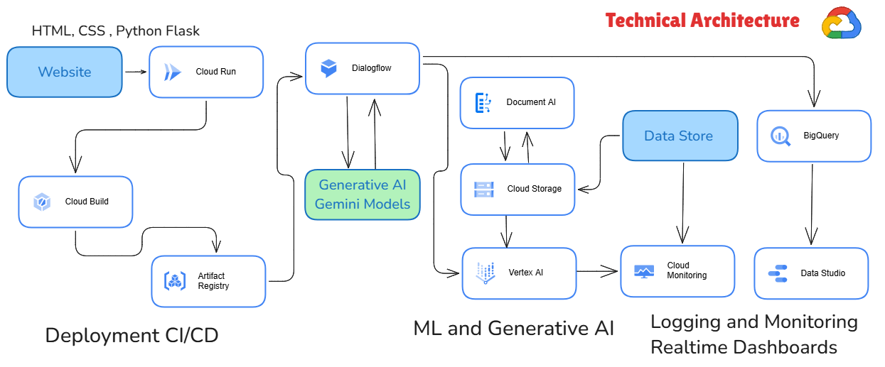

# Legal Assist Chatbot

**Supreme Court of India Hackathon 2024 Project**



## Table of Contents

- [Introduction](#introduction)
- [Problem Statement](#problem-statement)
- [Solution Overview](#solution-overview)
- [Technologies Used](#technologies-used)
- [Architecture](#architecture)
- [Future Improvements](#future-improvements)
- [Data Privacy and Security](#data-privacy-and-security)
- [Key Issues Foreseen](#key-issues-foreseen)
- [Getting Started](#getting-started)
- [Acknowledgements](#acknowledgements)

## Introduction

The **Legal Assist Chatbot** is a multilingual conversational AI tool designed to provide legal information and summarize court documents in English and various scheduled Indian languages. This project was developed for the Supreme Court of India Hackathon 2024.



## Problem Statement

To develop an artificial intelligence-based model for a conversational use-case chatbot in English and the scheduled languages of the Constitution of India, 1950, to answer queries about case-related information, summarization of judgments, court documents, etc.

## Solution Overview

Our solution is a multilingual legal chatbot that leverages the capabilities of Google Gemini's model with Retrieval-Augmented Generation (RAG). The chatbot is designed to:
- Provide accurate answers to legal queries.
- Summarize judgments and retrieve relevant court documents.
- Support multiple Indian languages for wider accessibility.
- Ensure compliance with data privacy regulations.

The chatbot is built using a scalable cloud platform, enabling it to handle large volumes of queries efficiently and provide a seamless user experience.

## Technologies Used

- **Retrieval-Augmented Generation (RAG):** For enhanced natural language processing and information retrieval.
- **Google Gemini:** Leveraging advanced NLP capabilities.
- **Vertex AI:** For orchestrating the retrieval, transformation, and generation processes.
- **Flask:** Used for creating the chatbot interface.
- **Vector Database:** For efficient semantic search and document retrieval.
- **Machine Learning Models:** Used to generate context-aware responses.

## Architecture



The Legal Assist Chatbot follows a multi-stage RAG architecture:
1. **Question Input:** The user poses a legal question.
2. **Semantic Search:** Using embeddings to find relevant documents or data.
3. **Vector Database:** Storing data as mathematical representations for efficient retrieval.
4. **Large Language Model (LLM):** Generates natural language responses based on retrieved context.
5. **Post-Processing:** Refining and ensuring the quality of the generated response.
6. **Response Output:** Presents the final answer to the user.

## Future Improvements

- **Expand Language Support:** Include more Indian languages and dialects.
- **Advanced NLP Models:** Integrate more sophisticated models for better context understanding.
- **Continuous Learning:** Implement feedback loops for model improvement based on user interactions.
- **Voice Integration:** Add voice support for enhanced user experience.
- **Real-Time Updates:** Incorporate real-time legal updates to ensure the most current information.
- **Cross-Platform Deployment:** Extend accessibility by deploying the chatbot on various platforms like mobile apps and social media.

## Data Privacy and Security

Ensuring the protection of sensitive legal information is crucial. We implement robust encryption, access controls, and compliance with data privacy laws to safeguard user data.

## Key Issues Foreseen

- **Real-Time Accuracy:** Ensuring real-time and accurate responses is challenging. We use efficient indexing and retrieval algorithms to enhance performance.
- **Model Bias:** Bias in language models can lead to incorrect or unfair responses. Regular audits and diverse training data are used to minimize biases.

## Getting Started

To get a copy of the project up and running on your local machine, follow these steps:

1. **Clone the Repository:**
   ```
   git clone https://github.com/Shrutika-211998/Legal-Assist-Chatbot.git
   ```
2. **Install Dependencies:**
   ```
   cd Legal-Assist-Chatbot
   pip install -r requirements.txt
   ```
3. **Run the Application:**
   ```
   flask run
   ```
   The chatbot should now be running on `http://localhost:5000`.


## Acknowledgements

We would like to thank the Supreme Court of India Hackathon 2024 for providing the opportunity to develop this project. Special thanks to our team members:

- Shreeja Sharma
- Shrutika Shripat
- Vijay Kumar
- Vishwas Dubey
- Yash Kavaiya

